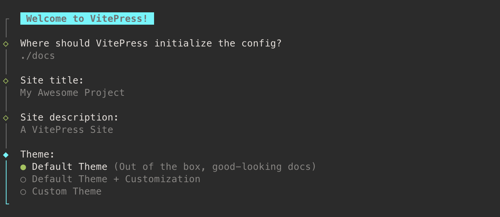

# 开始

## 在线尝试

你可以直接在你的浏览器中打开[StackBlitz](https://vitepress.new)尝试编写VitePress。

## 安装

### 前提

- [Node.js](https://nodejs.org/)版本>=16
- 能通过命令行界面访问VitePress的终端(CLI).
- 文本编辑器能支持[Markdown](https://en.wikipedia.org/wiki/Markdown)语法.
  - 推荐使用[VSCode](https://code.visualstudio.com/), 配合[Vue官方拓展](https://marketplace.visualstudio.com/items?itemName=Vue.volar).

VitePress能单独使用，也可以在现有的项目安装使用。这两种情况，你都可以使用以下命令进行安装：

::: code-group

```sh [npm]
$ npm install -D vitepress
```

```sh [pnpm]
$ pnpm add -D vitepress
```

```sh [yarn]
$ yarn add -D vitepress
```

:::

::: details 得到缺失安装包警告？
如果是使用PNPM，你可能会注意到一条缺失`@docsearch/js`安装包的警告，这个不会阻止VitePress正常运行。如果你想解决这个警告，在你的`package.json`文件中加上下面这个。

```json
"pnpm": {
  "peerDependencyRules": {
    "ignoreMissing": [
      "@algolia/client-search"
    ]
  }
}
```

:::

### 安装步骤

VitePress提供了命令来指导你搭建出一个基础的项目。在安装完成后，开始运行命令：

::: code-group

```sh [npm]
$ npx vitepress init
```

```sh [pnpm]
$ pnpm exec vitepress init
```

:::

这里有几个简单问题需要你回答：

<p>
  
</p>

:::tip Vue作为依赖包
如果你想使用Vue组件或API来构建自定义，你需要主动把`vue`作为依赖包给安装下来。
:::

## 文件目录

如果你在构建一个独立的VitePress站点，你可以把这个站点的脚手架放在你当前的目录下(`./`)。但是，如果你正在将VitePress安装在一个现有的项目中，并与其他源码混在一起。推荐的做法是将站点的脚手架放在一个嵌套的目录中(e.g. `./docs`)，这样它就能和项目的其他部分区分开来了。

假设你选择了将VitePress脚手架项目放在了`./docs`下，那生成的目录结构应该像下面这个样子：

```
.
├─ docs
│  ├─ .vitepress
│  │  └─ config.js
│  ├─ api-examples.md
│  ├─ markdown-examples.md
│  └─ index.md
└─ package.json
```

这个`docs`目录是被当成VitePress站点的项目根目录。这个`.vitepress` 目录是VitePress配置文件的预留位置，里面可以有dev server cache, build output和可选的定制主题代码。

:::tip
默认情况下，VitePress将它的开发服务缓存放在了`.vitepress/cache`，生产打包输出是放在`.vitepress/dist`。如果要使用git，你应该将git内容添加到你的`.gitignore` 文件中. 这些地方也都是可以[配置](/reference/site-config#outdir).
:::

### 配置文件

这个配置文件(`.vitepress/config.js`)允许你去自定义Vitepress站点的方方面面，最基本的选项是网站的标题和描述：

```js
// .vitepress/config.js
export default {
  // site-level options
  title: 'VitePress',
  description: 'Just playing around.',

  themeConfig: {
    // theme-level options
  }
}
```

你还可以通过`themeConfig`选项来配置主题的行为。详细信息可以查看[配置参考](/reference/site-config)，里面有所有配置的详细信息。

### 源文件

在`.vitepress`文件之外的Markdown文件是被认为是源文件。

VitePress使用**基于文件的路由**: 每个`.md`文件被编译成相同路径下对应的`.html` 文件。比如，`index.md`将被编译为`index.html`，并且在生成的VitePress站点下的根路径`/`进行访问。

VitePress也提供了生成短链接、重写路径以及动态生成页面的能力，这些在[路由导航](./routing)中都有介绍.

## 启动并运行

这个工具也能提供以下几个npm 脚本在你的`package.json`中，前提是在安装过程中你允许这么做：

```json
{
  ...
  "scripts": {
    "docs:dev": "vitepress dev docs",
    "docs:build": "vitepress build docs",
    "docs:preview": "vitepress preview docs"
  },
  ...
}
```

这个`docs:dev`脚本将会开启一个带有极速热更新的本地开发服务器，使用以下命令去运行它：

::: code-group

```sh [npm]
$ npm run docs:dev
```

```sh [pnpm]
$ pnpm run docs:dev
```

```sh [yarn]
$ yarn docs:dev
```

:::

不同于npm脚本，你也可以直接使用VitePress:

::: code-group

```sh [npm]
$ npx vitepress dev docs
```

```sh [pnpm]
$ pnpm exec vitepress dev docs
```

:::

更多的命令行使用都记录在[CLI 参考](/reference/cli)中。

这个开发服务器运行在`http://localhost:5173`上，在浏览器中打开该地址查看新站点的运行情况！

## 下一步是啥？

- 为了更好的理解markdown文件如何映射并生成HTML文件，可以前往[路由导航](./routing.md)继续学习。

- 为了发现更多在页面中能做的事情，比如写markdown内容或者使用Vue组件，请参考导航中的"Writing"部分。学习[Markdown拓展](/guide/markdown)就是一个不错的开始。

- 为了探索默认的文档主题所能提供的特性，请看看[默认主题配置参考](/reference/default-theme-config)。

- 如果你想更进一步的自定义站点外观，可以学习[拓展默认主题](./extending-default-theme)或者[创建自定义主题](./custom-theme)。

- 一旦你的文档站点初步成型，一定要去阅读一下[部署导航](./deploy)。
